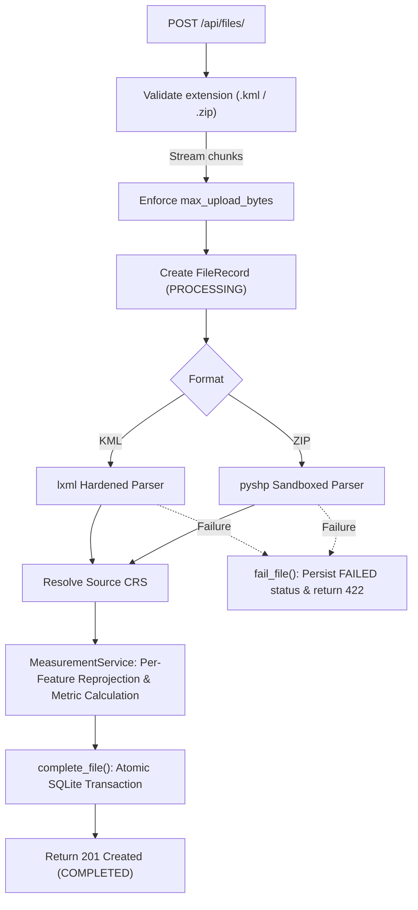

# Geospatial File Measurement API

A robust, production-grade backend service built with **FastAPI**, **Shapely ≥ 2.0**, **pyproj**, and **pyshp** for ingesting geospatial survey files, extracting geographic features, dynamically selecting optimal metric coordinate reference systems (UTM/UPS), and computing accurate geometric measurements (polygon area in $\text{m}^2$ and linestring length in $\text{m}$).

---

## 1. Overview & Key Capabilities

- **Supported Formats**: KML (`.kml`), KMZ (`.kmz` Google Earth compressed archives), Shapefile archives (`.zip`), **GeoJSON** (`.geojson`/`.json`), and **GeoPackage** (`.gpkg`).
- **Dynamic Metric Projection**: Features defined in geographic coordinates (`EPSG:4326` degrees) or projected systems (e.g. Web Mercator) are dynamically reprojected to local metric **UTM zones** (`EPSG:32601-32660` North, `EPSG:32701-32760` South) or **Universal Polar Stereographic** (UPS North `EPSG:32661` / UPS South `EPSG:32761`).
- **Real-Time Geodetic Engine**: Sub-millisecond arbitrary geometry measurement (`POST /api/measure/geometry/`) returning dual planar UTM metrics and WGS 84 ellipsoidal geodesics (`pyproj.Geod`).
- **Territorial Location & Terrain Elevation**: Real-time reverse geocoding via OpenStreetMap Nominatim and terrain altitude via Open-Elevation / SRTM.
- **Survey-Grade Accuracy**: Never evaluates distance or area in angular degrees squared. Verified against `pyproj.Geod` ellipsoidal calculations with $< 0.5\%$ divergence.
- **Defensive Ingestion**: Hardened against XXE/entity expansion, Zip-Slip path traversals, decompression bombs, and oversized uploads.
- **Production GIS Workbench**: Interactive Leaflet visualizer with Esri Satellite imagery, vector drawing tools (Polygon, Path, Pin), precision HUD, and RFC 7946 GeoJSON/CSV/KML exports.
- **Async Background Queue**: `POST /api/async/ingest/` enqueues large files to background workers; `GET /api/tasks/{id}/` polls status. Dashboard supports both sync and async modes with live progress feedback.
- **API Key Authentication**: Optional `GEO_API_KEY` environment variable gates all protected endpoints. Rate limiting via SlowAPI.
- **Prometheus Metrics**: `GET /metrics` exposes request counters, ingestion histograms, and duration gauges in Prometheus text format.

---

## 📚 Complete Project Documentation Index

| Document | Description | Link |
| :--- | :--- | :--- |
| **Product Requirements (PRD)** | User personas, functional requirements, scope & success criteria | [`docs/PRD.md`](docs/PRD.md) |
| **Technical Requirements (TRD)** | System architecture, mathematical formulation, schemas & API specifications | [`docs/TRD.md`](docs/TRD.md) |
| **Application Flow & Sequence** | Mermaid sequence diagrams, data transformations & async pipeline | [`docs/APP_FLOW.md`](docs/APP_FLOW.md) |
| **UI/UX Design & Wireflow** | Cyberdefend design tokens, layout hierarchy, component specifications & state machine | [`docs/UI_UX_FLOW.md`](docs/UI_UX_FLOW.md) |
| **User Usage Flow** | Step-by-step user onboarding, surveying, file uploads & SpaceX deck controls | [`docs/USER_USAGE_FLOW.md`](docs/USER_USAGE_FLOW.md) |
| **Implementation Deep Dive** | Karney WGS84 geodesics, dynamic UTM/UPS projection, parsers & hardening | [`docs/IMPLEMENTATION_DETAILS.md`](docs/IMPLEMENTATION_DETAILS.md) |
| **Interview Technical Q&A** | 25+ comprehensive architectural questions, edge cases, and design rationale | [`docs/INTERVIEW_QA.md`](docs/INTERVIEW_QA.md) |

---

## 2. Setup & Execution

### 2.1 Local Environment (Python 3.10+)

```bash
# 1. Create and activate virtual environment
python -m venv .venv

# On Linux / macOS:
source .venv/bin/activate
# On Windows (PowerShell):
.\.venv\Scripts\Activate.ps1

# 2. Upgrade pip and install dependencies
pip install --upgrade pip
pip install -r requirements-dev.txt

# 3. Generate sample test data
python tests/scripts/make_sample_shapefile.py

# 4. Run full test suite with Pytest (46 tests)
pytest -v
```

### 2.2 Running the Development Server

```bash
uvicorn app.main:create_app --factory --host 0.0.0.0 --port 8000 --reload
```
Interactive GIS Studio: `http://localhost:8000/`  
Interactive API documentation: `http://localhost:8000/docs`

### 2.3 Running via Docker

```bash
# Build the production image
docker build -t geo-measure-api:latest .

# Run container exposing port 8000
docker run -d -p 8000:8000 --name geo-api geo-measure-api:latest

# Check health
curl http://localhost:8000/health
```

### 2.4 Configuration Options

Environment variables can override default runtime limits:

| Environment Variable | Default | Description |
|---|---|---|
| `GEO_DB_PATH` | `data/geomeasure.db` | Filepath for the SQLite database. |
| `GEO_MAX_UPLOAD_BYTES` | `52428800` (50 MB) | Maximum permitted upload file size. |
| `GEO_MAX_UNCOMPRESSED_BYTES` | `209715200` (200 MB) | Decompression byte ceiling for zip archives. |
| `GEO_MAX_ZIP_MEMBERS` | `100` | Maximum member count in a zip archive. |
| `GEO_MAX_FEATURES` | `10000` | Maximum features parsed per file. |
| `GEO_MAX_WARNINGS` | `50` | Maximum warnings recorded per file. |
| `GEO_CHUNK_SIZE_BYTES` | `1048576` (1 MB) | Chunk buffer size for upload streaming. |

---

## 3. API Reference & Endpoints Summary

### 3.1 Endpoints Summary

| Method | Endpoint | Description | Status Codes |
|---|---|---|---|
| `GET` | `/health` | Healthcheck endpoint | 200 |
| `GET` | `/metrics` | Prometheus metrics exposition | 200 |
| `GET` | `/api/files/config/` | Retrieve runtime limits and allowed extensions | 200 |
| `POST` | `/api/files/` | Stream and ingest KML, KMZ, Shapefile ZIP, GeoJSON, or GeoPackage (sync) | 201, 413, 415, 422 |
| `POST` | `/api/async/ingest/` | Enqueue file for background ingestion | 202, 413, 415 |
| `GET` | `/api/tasks/` | List recent async ingestion tasks | 200 |
| `GET` | `/api/tasks/{id}/` | Poll async task status | 200, 404 |
| `GET` | `/api/files/` | List all ingested files | 200 |
| `GET` | `/api/files/latest` | Get most recently ingested completed file | 200, 404 |
| `GET` | `/api/files/{id}/` | Retrieve file ingestion status and metadata | 200, 404 |
| `GET` | `/api/files/{id}/measurements/` | Paginated measurements and whole-file summary | 200, 404, 409 |
| `GET` | `/api/files/{id}/features/` | Paginated GeoJSON features in native CRS | 200, 404, 409 |
| `GET` | `/api/files/{id}/export/geojson/` | Download RFC 7946 GeoJSON FeatureCollection | 200, 404, 409 |
| `GET` | `/api/files/{id}/export/csv/` | Download complete tabular measurements as CSV | 200, 404, 409 |
| `GET` | `/api/files/{id}/export/kml/` | **Download KML 2.2 with ExtendedData measurements** | 200, 404, 409 |
| `POST` | `/api/measure/geometry/` | Real-time arbitrary GeoJSON geometry measurement | 200, 422 |
| `GET` | `/api/measure/reverse-geocode/` | Real-time administrative location reverse lookup (GET) | 200 |
| `POST` | `/api/measure/reverse-geocode/` | Real-time administrative location reverse lookup (POST) | 200 |
| `GET` | `/api/measure/elevation/` | Real-time terrain altitude query (SRTM, GET) | 200 |
| `POST` | `/api/measure/elevation/` | Real-time terrain altitude query (SRTM, POST) | 200 |

---

### 3.2 Real Captured Requests and Responses

#### Health Check
```bash
curl -X GET http://localhost:8000/health
```
```json
{
  "status": "ok",
  "service": "geo-measure-api"
}
```

#### Upload File (`POST /api/files/`)
```bash
curl -X POST http://localhost:8000/api/files/ \
  -F "file=@tests/sample_data/survey.kml"
```
```json
{
  "id": "0efebd98f22346f59bf3bb4159d1b12c",
  "filename": "survey.kml",
  "feature_count": 5,
  "crs": "EPSG:4326",
  "status": "COMPLETED",
  "created_at": "2026-10-07T07:23:01.720048+00:00",
  "warnings": [],
  "error": null
}
```

#### Get File Metadata (`GET /api/files/{id}/`)
```bash
curl -X GET http://localhost:8000/api/files/0efebd98f22346f59bf3bb4159d1b12c/
```
```json
{
  "id": "0efebd98f22346f59bf3bb4159d1b12c",
  "filename": "survey.kml",
  "feature_count": 5,
  "crs": "EPSG:4326",
  "status": "COMPLETED",
  "created_at": "2026-10-07T07:23:01.720048+00:00",
  "warnings": [],
  "error": null
}
```

#### Get Measurements (`GET /api/files/{id}/measurements/?limit=100&offset=0`)
```bash
curl -X GET "http://localhost:8000/api/files/0efebd98f22346f59bf3bb4159d1b12c/measurements/"
```
```json
{
  "file_id": "0efebd98f22346f59bf3bb4159d1b12c",
  "source_crs": "EPSG:4326",
  "units": {
    "area": "sq_m",
    "length": "m"
  },
  "summary": {
    "feature_count": 5,
    "measured_count": 4,
    "not_applicable_count": 1,
    "unsupported_count": 0,
    "error_count": 0,
    "total_area_sq_m": 444622.43,
    "total_length_m": 2865.97
  },
  "total": 5,
  "limit": 100,
  "offset": 0,
  "measurements": [
    {
      "feature_index": 0,
      "geometry_type": "Polygon",
      "status": "MEASURED",
      "area_sq_m": 300422.8,
      "length_m": null,
      "measurement_crs": "EPSG:32643",
      "message": null
    },
    {
      "feature_index": 1,
      "geometry_type": "Polygon",
      "status": "MEASURED",
      "area_sq_m": 144199.63,
      "length_m": null,
      "measurement_crs": "EPSG:32643",
      "message": null
    },
    {
      "feature_index": 2,
      "geometry_type": "LineString",
      "status": "MEASURED",
      "area_sq_m": null,
      "length_m": 1550.44,
      "measurement_crs": "EPSG:32643",
      "message": null
    },
    {
      "feature_index": 3,
      "geometry_type": "Point",
      "status": "NOT_APPLICABLE",
      "area_sq_m": null,
      "length_m": null,
      "measurement_crs": null,
      "message": "Point features do not possess area or length"
    },
    {
      "feature_index": 4,
      "geometry_type": "LineString",
      "status": "MEASURED",
      "area_sq_m": null,
      "length_m": 1315.53,
      "measurement_crs": "EPSG:32643",
      "message": null
    }
  ]
}
```

#### Get Features (`GET /api/files/{id}/features/?limit=2&offset=0`)
```bash
curl -X GET "http://localhost:8000/api/files/0efebd98f22346f59bf3bb4159d1b12c/features/?limit=2"
```
```json
{
  "file_id": "0efebd98f22346f59bf3bb4159d1b12c",
  "total": 5,
  "limit": 2,
  "offset": 0,
  "features": [
    {
      "feature_index": 0,
      "geometry_type": "Polygon",
      "geometry": {
        "type": "Polygon",
        "coordinates": [
          [
            [77.59, 12.97],
            [77.595, 12.97],
            [77.595, 12.975],
            [77.59, 12.975],
            [77.59, 12.97]
          ]
        ]
      },
      "properties": {
        "name": "Plot Alpha - Agricultural Field",
        "description": "Rice paddy field with perimeter fence",
        "crop_type": "Paddy Rice",
        "irrigation": "Canal"
      },
      "source_crs": "EPSG:4326",
      "created_at": "2026-10-07T07:23:01.762485+00:00"
    },
    {
      "feature_index": 1,
      "geometry_type": "Polygon",
      "geometry": {
        "type": "Polygon",
        "coordinates": [
          [
            [77.6, 12.98],
            [77.604, 12.98],
            [77.604, 12.984],
            [77.6, 12.984],
            [77.6, 12.98]
          ],
          [
            [77.601, 12.981],
            [77.603, 12.981],
            [77.603, 12.983],
            [77.601, 12.983],
            [77.601, 12.981]
          ]
        ]
      },
      "properties": {
        "name": "Plot Beta - Storage Reservoir with Island",
        "description": "Water reservoir with a protected central vegetation island",
        "facility_id": "RES-402",
        "status": "Active"
      },
      "source_crs": "EPSG:4326",
      "created_at": "2026-10-07T07:23:01.762485+00:00"
    }
  ]
}
```

#### Upload Shapefile ZIP (`POST /api/files/`)
```bash
curl -X POST http://localhost:8000/api/files/ \
  -F "file=@tests/sample_data/survey_shapefile.zip"
```
```json
{
  "id": "52f51cba7d8b4ce1bb14ca4c0b5f54b7",
  "filename": "survey_shapefile.zip",
  "feature_count": 3,
  "crs": "EPSG:4326",
  "status": "COMPLETED",
  "created_at": "2026-10-07T07:25:47.049791+00:00",
  "warnings": [],
  "error": null
}
```

#### Shapefile Measurements (`GET /api/files/{id}/measurements/`)
```bash
curl -X GET "http://localhost:8000/api/files/52f51cba7d8b4ce1bb14ca4c0b5f54b7/measurements/"
```
```json
{
  "file_id": "52f51cba7d8b4ce1bb14ca4c0b5f54b7",
  "source_crs": "EPSG:4326",
  "units": {
    "area": "sq_m",
    "length": "m"
  },
  "summary": {
    "feature_count": 3,
    "measured_count": 3,
    "not_applicable_count": 0,
    "unsupported_count": 0,
    "error_count": 0,
    "total_area_sq_m": 642904.91,
    "total_length_m": 0.0
  },
  "total": 3,
  "limit": 100,
  "offset": 0,
  "measurements": [
    {
      "feature_index": 0,
      "geometry_type": "Polygon",
      "status": "MEASURED",
      "area_sq_m": 300422.8,
      "length_m": null,
      "measurement_crs": "EPSG:32643",
      "message": null
    },
    {
      "feature_index": 1,
      "geometry_type": "Polygon",
      "status": "MEASURED",
      "area_sq_m": 192265.93,
      "length_m": null,
      "measurement_crs": "EPSG:32643",
      "message": null
    },
    {
      "feature_index": 2,
      "geometry_type": "Polygon",
      "status": "MEASURED",
      "area_sq_m": 150216.18,
      "length_m": null,
      "measurement_crs": "EPSG:32643",
      "message": null
    }
  ]
}
```

---

## 4. Architecture & Data Flow

### 4.1 Project Tree
```
app/
├── __init__.py
├── main.py              # Application factory, exception handlers, /health
├── config.py            # Frozen dataclass Settings.from_env()
├── domain.py            # Pure dataclasses & enums (ZERO third-party dependencies)
├── errors.py            # GeoServiceError hierarchy (415, 413, 422, 404, 409)
├── api/
│   ├── __init__.py
│   ├── deps.py          # FastAPI request dependencies
│   ├── routes.py        # Synchronous def routes executing in threadpools
│   └── schemas.py       # Pydantic v2 schemas
├── parsers/
│   ├── __init__.py
│   ├── kml.py           # Hardened, namespace-agnostic lxml KML parser
│   └── shapefile_zip.py # pyshp reader with zip-slip & bomb guards
├── services/
│   ├── __init__.py
│   ├── projection.py    # Arithmetic UTM/UPS zone selection logic
│   ├── measurement.py   # Metric reprojection & Shapely measurement engine
│   └── ingest.py        # Streaming file ingest orchestrator
└── storage/
    ├── __init__.py
    └── repository.py    # SQLite WAL data access with atomic transactions
```

### 4.2 File Processing Flow


### 4.3 Coordinate Reference System (CRS) Selection Strategy
1. **Centroid Coordinate Extraction**: Evaluate centroid in WGS84 geographic degrees (reprojecting from source CRS if already projected).
2. **Zone Identification**:
   - $\text{Latitude} > 84^\circ\text{N} \to \text{Universal Polar Stereographic North (EPSG:32661)}$.
   - $\text{Latitude} < -80^\circ\text{S} \to \text{Universal Polar Stereographic South (EPSG:32761)}$.
   - Otherwise: Zone number $Z = \lfloor(\text{lon} + 180) / 6\rfloor + 1$. Target CRS is `EPSG:32600 + Z` (North) or `EPSG:32700 + Z` (South).
3. **Axis Order Enforcement**: All `pyproj.Transformer` instances are initialized with `always_xy=True`, ensuring `(x, y) = (lon/easting, lat/northing)` coordinate alignment.

---

## 5. Design Decisions & Trade-Offs

| Decision | Alternatives Considered | Rationale / Why |
|---|---|---|
| **Dynamic UTM per Feature** | Web Mercator (EPSG:3857) or single global equal-area projection. | Web Mercator distorts area by $> 400\%$ at high latitudes. UTM provides $< 0.4\%$ scale distortion across drone plots globally. |
| **Pure Python Stack (`pyshp`, `shapely`, `pyproj`)** | Heavy GDAL/Fiona C-libraries. | GDAL binaries frequently cause build and Docker platform incompatibilities; pure Python + prebuilt wheels guarantee friction-free builds. |
| **Standard `def` Route Handlers** | `async def` routes. | Geometry calculation and parsing are CPU-bound. Defining routes as `def` causes FastAPI to run them in threadpools, preventing asyncio event loop starvation. |
| **Single Atomic Transaction in `complete_file`** | Row-by-row autocommit insertions. | Guarantees that partial failures or server restarts never leave orphaned features or files stuck in `PROCESSING`. |
| **Whole-File SQL Aggregation for Summaries** | Computing summary in Python over paginated response items. | Calculating over paginated items gives misleading numbers under `?limit=10`. SQL aggregate ensures file-level totals remain true. |
| **Graceful Feature Skipping** | All-or-nothing validation (aborting file on first invalid placemark). | Real drone surveys frequently contain incidental null geometries or unsupported annotation markers; skipping bad items with warnings maximizes operational utility. |

---

## 6. Known Limitations

- **Altitude Ignored**: KML coordinates `[lon, lat, alt]` drop altitude; measurements represent 2D planar projection surfaces.
- **Features Spanning Multiple UTM Zones**: Features spanning $> 6^\circ$ are projected to the UTM zone of their centroid. While suitable for drone surveys, continental polygons will experience scale distortion near boundaries.
- **Antimeridian Crossing**: Polygons crossing the $180^\circ$ meridian must be split prior to projection to avoid bounding box wrapping.
- **Heterogeneous MultiGeometry**: KML files containing mixed Points and Polygons in a single `MultiGeometry` are marked `UNSUPPORTED`.
- **KMZ Archives**: Zipped KML (`.kmz`) is not yet natively unpacked (requires unzipping `.kml` member).

---

## 7. Concrete Engineering Learnings

1. **The Pyproj.Geod Hole Winding Trap**:
   During oracle testing, `pyproj.Geod.geometry_area_perimeter()` was observed adding inner ring areas instead of subtracting them when hole coordinates shared the exterior ring's winding direction. Shapely planar geometries always subtract holes regardless of winding order. Independent oracle testing requires computing `exterior_area - sum(hole_areas)` explicitly.
2. **The Geographic Degree Area Disaster**:
   A $450\text{m} \times 450\text{m}$ farm plot evaluates to $\approx 200,000\text{ m}^2$ in UTM, but evaluates to $\approx 0.00002$ in raw degree coordinates. Strict typing and guard unit tests asserting `area_sq_m > 100,000` are essential safeguards.
3. **The Axis Order Inversion**:
   The EPSG registry defines EPSG:4326 as `(lat, lon)`, while GeoJSON/KML/Shapefiles store `(lon, lat)`. Without `always_xy=True` on Pyproj transformers, coordinates are silently inverted, moving polygons across the equator.
4. **Windows File Locks on Temporary Directories**:
   On Windows, `shapefile.Reader` maintains open file handles on `.dbf` files. If `reader.close()` is not invoked in a `finally` block before exiting a `tempfile.TemporaryDirectory()`, `shutil.rmtree()` fails with `PermissionError: [WinError 32]`.
5. **Hostile Upload Sandboxing**:
   Untrusted GIS archives must be treated as hostile inputs. Relying on standard `extractall()` or default XML parsers exposes servers to Zip-Slip directory traversals and Billion-Laughs XXE crashes.

---

## 8. Production Roadmap & Implementation Status

| Feature | Status |
|---|---|
| **Asynchronous Processing Queue** (Background workers, HTTP 202 Accepted, task polling) | ✅ Implemented |
| **GeoJSON & GeoPackage Parsers** (`.geojson`, `.json`, `.gpkg` ingestion) | ✅ Implemented |
| **KML Export** (`GET /api/files/{id}/export/kml/` with ExtendedData measurements) | ✅ Implemented |
| **API Key Authentication + Rate Limiting** (SlowAPI, `X-API-Key` header) | ✅ Implemented |
| **Prometheus Metrics** (`GET /metrics`, HTTP counters, ingestion histograms) | ✅ Implemented |
| **Interactive GIS Dashboard** (Leaflet, 3-view, draw tools, basemap switching) | ✅ Implemented |
| **PostGIS Relational Spatial Engine** (PostgreSQL/PostGIS migration) | 🔲 Future |
| **Cloud Object Storage** (S3 / GCS presigned URL integration) | 🔲 Future |
| **OpenTelemetry Tracing** (Distributed trace propagation) | 🔲 Future |
| **FlatGeobuf / Cloud-Optimized GeoTIFF Formats** | 🔲 Future |
