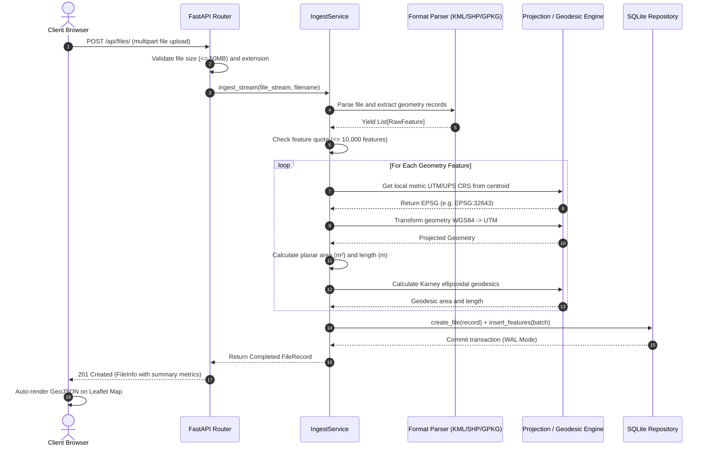
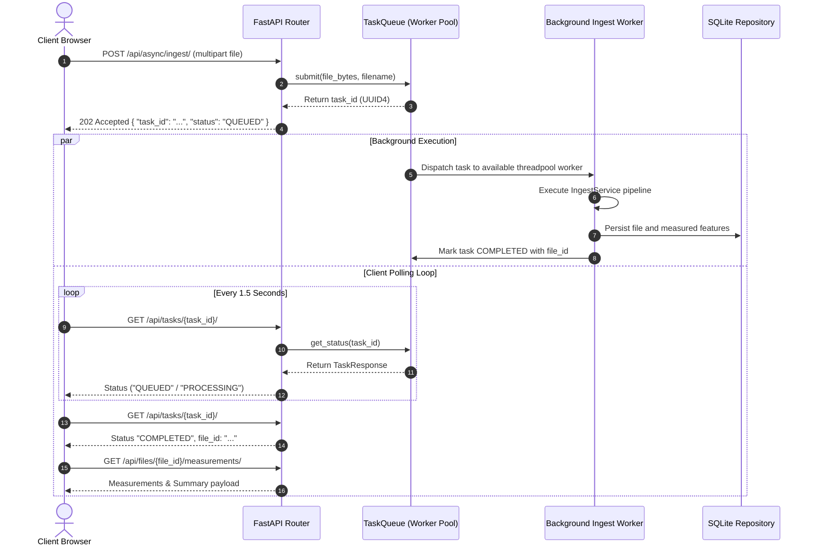
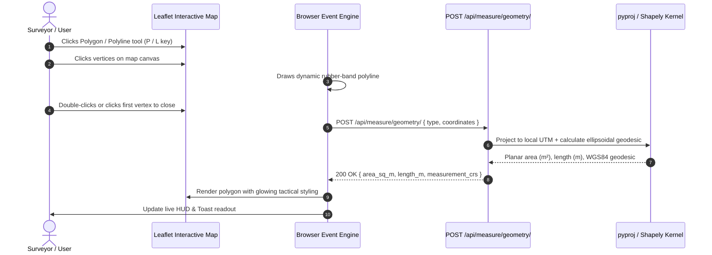
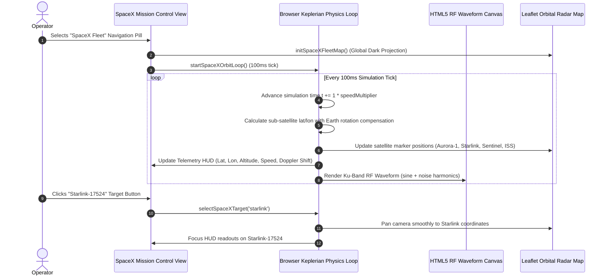

# Application Flow & Data Architecture (APP_FLOW.md)
## Geospatial File Measurement & Orbital Telemetry Platform

This document describes the complete runtime lifecycle, data transformations, asynchronous job scheduling, and export flows of the platform.

---

## 1. End-to-End System Pipeline

```mermaid
graph TD
    A[Client User Interface] -->|Upload File .kml, .kmz, .zip, .geojson, .gpkg| B(FastAPI Gateway)
    
    subgraph Security & Validation
        B --> C{Size <= 50MB?}
        C -->|No| E1[HTTP 413 File Too Large]
        C -->|Yes| D{Allowed Extension?}
        D -->|No| E2[HTTP 415 Unsupported Media]
        D -->|Yes| E[MIME & Archive Quota Check]
        E -->|Uncompressed > 200MB| E3[HTTP 422 Archive Too Large]
    end

    subgraph Dual Ingestion Pathways
        E --> F{Sync or Async?}
        F -->|Sync| G[IngestService in Threadpool]
        F -->|Async| H[Submit to InMemory TaskQueue]
        H -->|Return 202| I[Client Polls /api/tasks/{id}/]
        H -.->|Background Worker| G
    end

    subgraph Processing Kernel
        G --> J[Format Parser: KML/KMZ/Shapefile/GeoJSON/GPKG]
        J --> K[Iterate Features WGS 84]
        K --> L[Calculate Feature Centroid]
        L --> M[Determine Local Metric UTM / UPS Zone]
        M --> N[Reproject Geometry via pyproj]
        N --> O[Compute Planar Area & Length via Shapely 2.0]
        O --> P[Compute Karney Geodesic Verification]
        P --> Q[Batch Insert into SQLite DB]
    end

    subgraph Presentation & Exports
        Q --> R[Update Workspace Map & Feature Registry]
        R --> S[Export GeoJSON]
        R --> T[Export CSV]
        R --> U[Export KML 2.2 ExtendedData]
    end
```

---

## 2. Ingestion Sequence Flow (Synchronous Mode)



---

## 3. Asynchronous Queue & Polling Sequence Flow



---

## 4. Interactive Live Vector Digitizing Flow



---

## 5. SpaceX Orbital Fleet Real-Time Engine Flow


