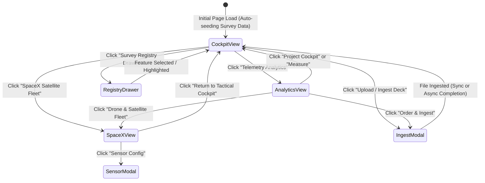

# UI/UX Design System & Experience Flow (UI_UX_FLOW.md)
## Geospatial File Measurement & Orbital Telemetry Platform

This document describes the aesthetic design tokens, layout hierarchy, navigation wireflow, and interaction states of the user interface.

---

## 1. Design Philosophy & Aesthetic Pillars

The UI adopts a **Cyber-Tactical Defense Command Deck & SpaceX Mission Control** aesthetic, fused with **Figma Dark Neumorphism**:

1. **Void Dark Backgrounds**: Primary canvas relies on deep space tones (`#020617`, `#080c14`, `#0d1527`), providing maximum visual contrast for vibrant vector layers.
2. **Curated Color Tokens**:
   - **Primary Action (Tactical Amber)**: `#facc15` (`var(--accent-yellow)`) — highlights primary controls, active tools, and active vectors.
   - **Satellite / LEO Cyan**: `#38bdf8` (`var(--accent-cyan)`) — displays telemetry links, orbital tracks, and GeoJSON badges.
   - **Radar Emerald**: `#34d399` / `#10b981` (`var(--accent-green)`) — indicates online status, GPS lock, and calculated parcel areas.
   - **Warning / Distress Rose**: `#f43f5e` (`var(--accent-rose)`) — signifies deletion actions, ISS target, and high-risk operations.
3. **Glassmorphism & Depth**: Multi-layer translucent panels using `backdrop-filter: blur(20px)`, `rgba(8, 12, 20, 0.94)`, and subtle radial outer-glow box shadows.
4. **Typography**: High-legibility modern sans-serif (`Inter`, system stack) paired with fixed-pitch monospaced fonts (`JetBrains Mono`, `Fira Code`) for numerical coordinate data.

---

## 2. Layout & View Hierarchy

The interface is structured into three primary full-screen operational views hosted inside `#main-host`:

```
┌────────────────────────────────────────────────────────────────────────┐
│ TOP COMMAND HEADER (54px)                                              │
│ [CYBERDEFEND Logo]   [Cockpit Pill] [Analytics Pill] [SpaceX Pill]    │
├─────────┬──────────────────────────────────────────────────────────────┤
│ ICON    │ ACTIVE OPERATIONAL VIEW                                      │
│ SIDEBAR │                                                              │
│ RAIL    │  VIEW 1: Tactical GIS Cockpit                                │
│ (58px)  │   - Fullscreen Leaflet Canvas with CARTO Dark / Esri         │
│         │   - Top-Left: Floating Radar Telemetry HUD                   │
│ [🛰️]   │   - Top-Right: Drawing Tools Ribbon (Polygon, Line, Circle)  │
│ [📊]   │   - Bottom-Left: Basemap Switcher Pill                       │
│ [🚀]   │   - Bottom-Right: Layer Opacity & Vector Color Palette       │
│         │                                                              │
│ [🗂️]   │  VIEW 2: Telemetry Analytics Dashboard (Figma Neumorphism)    │
│ [⬆]     │   - SVG Donut Chart (Polygons vs Lines vs Points)            │
│         │   - Dimension Breakdown Cards (Total Area, Total Length)     │
│         │   - Recent Parcels Registry Table                            │
│         │                                                              │
│         │  VIEW 3: SpaceX Satellite Fleet Mission Control              │
│         │   - Global 2D/3D Tactical Orbital Tracking Map               │
│         │   - Pulsing Satellites (Aurora-1, Starlink, Sentinel, ISS)   │
│         │   - Live Keplerian Telemetry HUD (Alt, Speed, Doppler)       │
│         │   - HTML5 Animated RF Ku-Band Waveform Canvas                │
└─────────┴──────────────────────────────────────────────────────────────┘
```

---

## 3. Navigation State Machine



---

## 4. Component Design Specifications

### 4.1 Ingestion Deck Modal (Dual-Tab UI)
- **Tab 1: Upload Archive**:
  - Drag-and-drop zone with format badges (`.kml`, `.kmz`, `.zip`, `.geojson`, `.gpkg`).
  - Streaming XHR upload progress bar (`0% → 100%`) with byte throughput text.
  - Asynchronous background queue checkbox toggle.
- **Tab 2: File History Registry**:
  - Live query to `GET /api/files/`.
  - Renders cards with file format badge, size in KB/MB, feature count, and status badge (`COMPLETED` in green).
  - One-click **"Load"** button to project immediately into the active viewport.
  - Direct download buttons: **JSON**, **CSV**, **KML**.

### 4.2 Interactive Drawing Ribbon
- Located floating at top-right of the cockpit (`z-index: 500`).
- **Tools**:
  - **Polygon (`P`)**: Polygonal area digitizing with real-time rubber band polyline.
  - **Line (`L`)**: Linear survey corridor measurement.
  - **Circle / Buffer (`B`)**: Radial geodesic buffer zone with interactive radius slider (10 m to 5,000 m).
  - **Pin GPS (`X`)**: Instant browser geolocation fix with accuracy radius circle.
  - **Clear**: Reset active live digitization layers.

### 4.3 Feature Registry Slide-Out Drawer
- Width: `420px`, slides out smoothly from right edge (`right: 0`, `transition: transform 0.3s cubic-bezier(0.16, 1, 0.3, 1)`).
- Search input with real-time substring filtering across feature properties and indices.
- Geometry filter pills: `All`, `Polygons`, `Lines`, `Points`.
- Tabular feature view with column sorting (Index, Type, Area, Perimeter).
- Detail inspect card showing planar area, WGS 84 geodesic area, and reverse-geocoded territory address.

### 4.4 SpaceX Orbital Deck
- Tactical global map with sub-satellite position markers moving every 100 ms.
- Orbit speed selector: `1x`, `5x`, `20x`, `Pause/Resume`.
- Floating HUD displaying sub-satellite coordinates, altitude, orbital velocity, and Doppler frequency offset.
- Real-time animated HTML5 canvas oscilloscope for Ku-band RF telemetry (14.25 GHz).
